# Smart Grid Server

## Nom du groupe : DEBEAULIEU Anatole, GARNIER Baptiste

## Lien du dépot Github : 
https://github.com/GarnierBaptiste/Projet_SAE

Nous avons crée ce dépot Github principalement pour le compte rendu, donc les commit ne montrent pas l'avancement de la réalisation du projet.

## Téléchargement nécessaire

Avant de pouvoir tester notre code, il est nécessaire de télécharger 3 éléments : 

- Le JDK 25 : https://www.oracle.com/java/technologies/downloads/#java25
- Apache Maven : https://maven.apache.org/download.cgi
- Docker Desktop : https://www.docker.com/products/docker-desktop/

Si on utilise l'IDE VSCode il est aussi recommandé de télécharger les extensions suivantes :

- Extension Java Extension Pack : https://marketplace.visualstudio.com/items?itemName=vscjava.vscode-java-pack
- Debugger for java : https://marketplace.visualstudio.com/items?itemName=vscjava.vscode-java-debug

## Utilisation de l'API

Pour tester notre code il faut dans un premier temps ouvrir Docker Dekstop et lancé la commande "docker compose up -d" au niveau de la racine du projet. Qaund les conteneurs se sont initialisée/démarré, on doit lancer le fichier "VertxServer.java" qui se trouve dans le dossier "src/main/java". Après cela, l'API est opérationnelle et on peut faire les différentes requêtes pour tester les différentes fonctions de l'API. Elle est disponible à l'adresse web suivant : https://hub.imt-atlantique.fr/ueinfo-fise1a/s6/project/session4/projet/index.html.

Pour voire les données de la base de données, on peut se rendre à l'adresse web suivante : http://localhost:8082/ dans laquelle on pourra observer les différent users ainsi que tout les sensors (producers comme consumers) et les donées de l'unique grid du projet. On peut aussi créer, sur cette page, un nouvel utilisateur auquel on pourra liée les différents sensors comme nous le souhaitons.

## Partie Required

### Get : /grids List all grid IDs

Renvoie la liste des IDs des éléments de la classe Grid en utilisant la route Get /grids.

Ce que nous renvoie notre fonction :

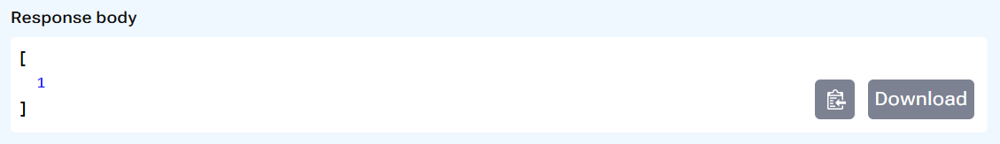

Ce que la fonction est censée nous renvoyer :

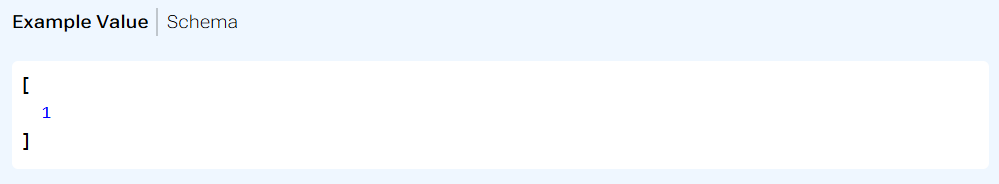

### Get : /grid/{id} Get grid details

Renvoie les détail de la Grid dont l'id est rentré en paramètre en utilisant la route Get /grid/{id}.

Ce que nous renvoie notre fonction en mettant en paramère l'id à 1 :

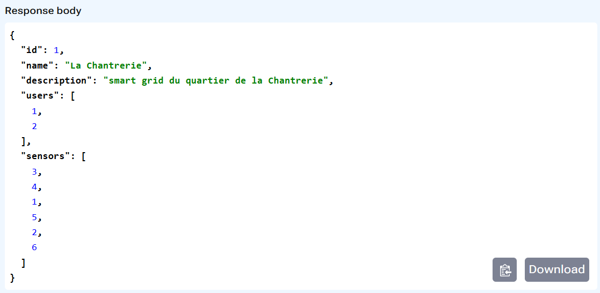

Ce que la fonction est censée nous renvoyer en mettant en paramètre l'id à 1 :

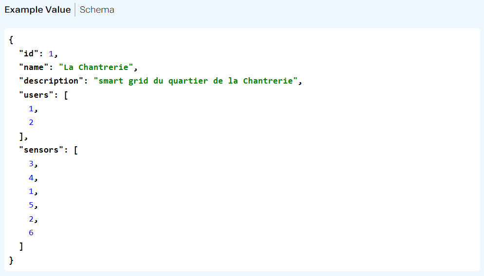

### Get : /persons List all person IDs

Renvoie la liste des IDs des éléments de la classe Person en utilisant la route Get /persons.

Ce que nous renvoie notre fonction :

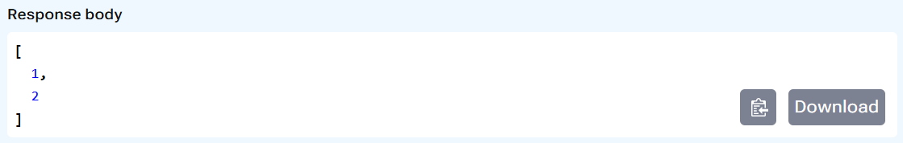

Ce que la fonction est censée nous renvoyer :

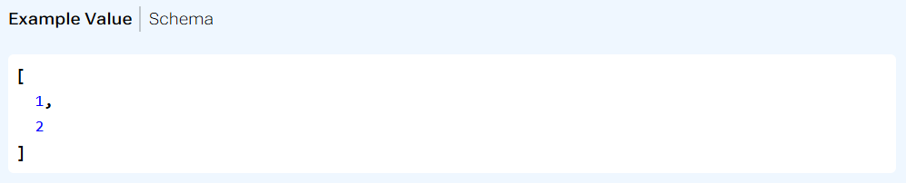

### Get : /person/{id} Get person by IDs

Renvoie les détails d'un objet de la table Person dont l'id est rentré en paramètre en utilisant la route Get /person/{id}.

Ce que nous renvoie notre fonction en mettant en paramètre l'id à 1 :

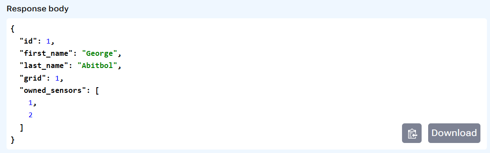

Ce que la fonction est censée nous renvoyer en mettant en paramètre l'id à 1 :

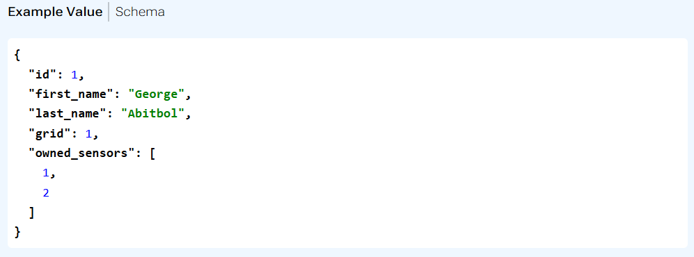

### Get : /measurement/{id} Get measurement definition

Renvoie les détails d'un objet de la classe Measurement dont l'id est donné en paramètre de la route. La route utilisée est Get /measurement/{id}.

Ce que nous renvoie notre fonction en mettant en paramètre l'id à 1 :

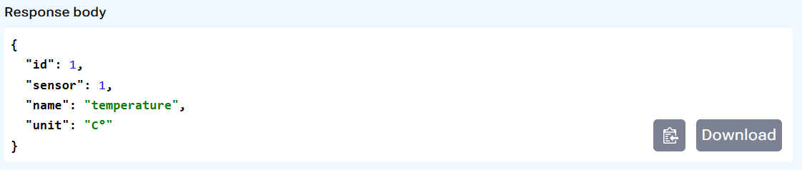

Ce que la fonction est censée nous renvoyer en mettant en paramètre l'id à 1 :

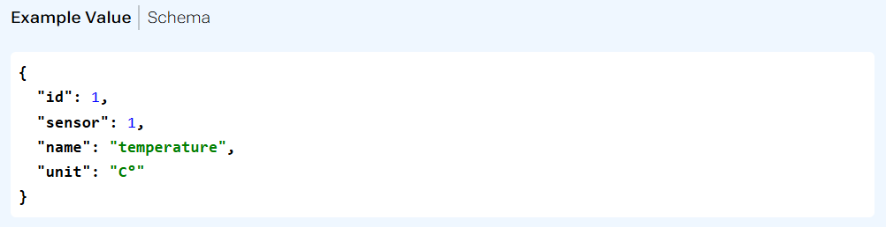

## Partie Medium

### Put : /person Create a new person

Crée une nouvelle personne dans la table Person en utilisant la route Put /person.

Ce que nous renvoie notre fonction après la création de la nouvelle personne si tous les éléments sont présents et qu'il y ait 41 personnes dans la base de données :

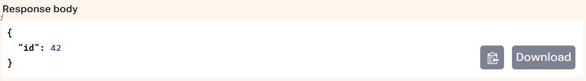

Ce que la fonction est censée nous renvoyer après la création de la nouvelle personne si tous les éléments sont présents et qu'il y est déjà 41 personnes dans la base de données:

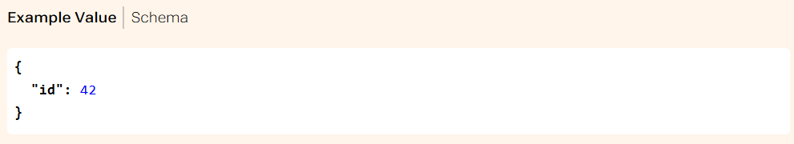

Ce que nous renvoie la fonction après la création de la nouvelle personne si le first_name est manquant :

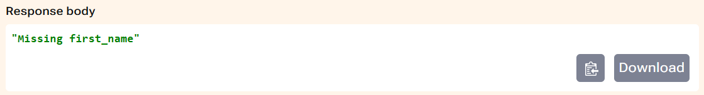

Ce que la fonction est censée nous renvoyer après la création de la nouvelle personne si le first_name est manquant :

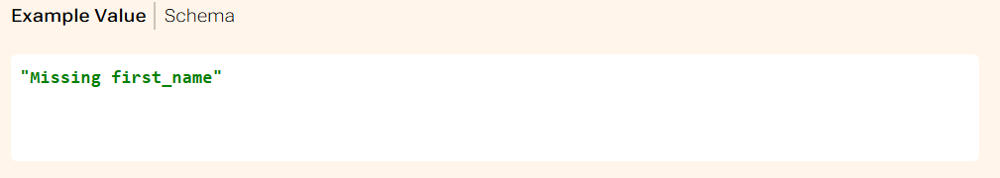

### Post : /person/{id} Update person-values

Met à jour les détails d'un objet de la classe Person pour un id donné en paramètre de la route, en utilisant la route Post /person/{id}.

Ce que nous renvoie notre fonction en mettant en paramètre l'id à 1 après la mise à jour de la personne en cas de résussite :

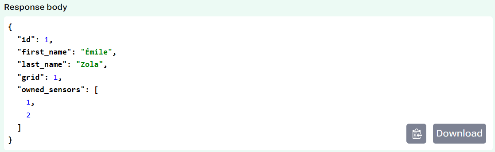

Ce que la fonction est censée nous renvoyer en mettant en paramètre l'id à 1 après la mise à jour de la personne en cas de résussite :

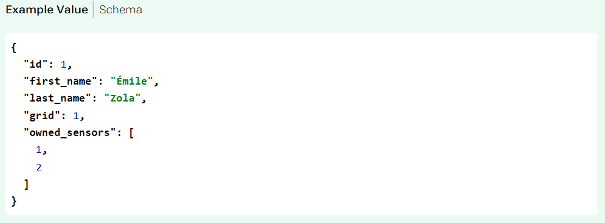

Ce que nous renvoie notre fonction l'id ne correspind à auncune personnes dans la base de données :

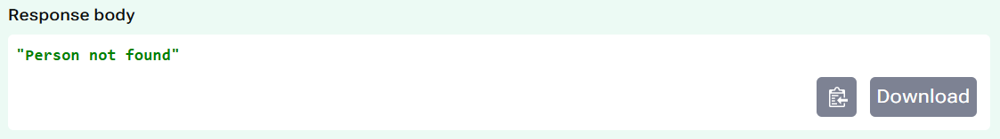

Ce que la fonction est censée nous renvoyer l'id ne correspind à auncune personnes dans la base de données :

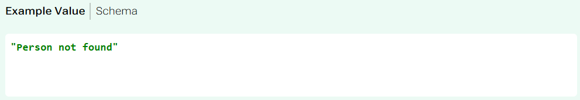

### Delete : /person/{id} Delete a person

Supprime une personne de la table Person pour un id donné en paramètre de la route. La route utilisée est Delete /person/{id}.

Voic l'id de toute les personnes de la base de données avant la suppression de la personne dont l'id est 3 :

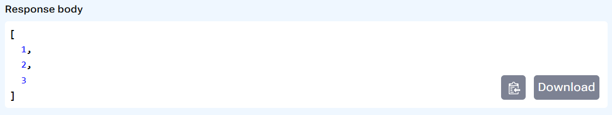

Voici l'id de toute les personnes de la base de données après la suppression de la personne dont l'id est 3 :

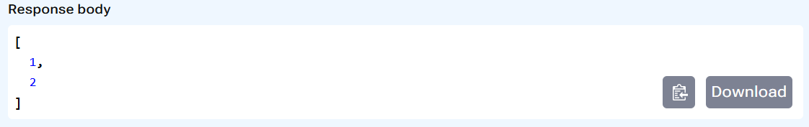

Voici ce que nous renvoie la fonction s'il l'id mis en paramèrtre ne correspond à aucune personne dans la base de données :

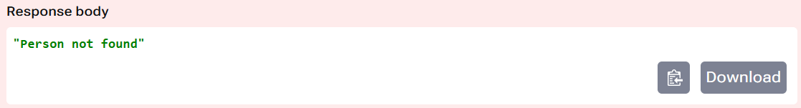

Voici ce que la fonction est censée nous renvoyer s'il l'id mis en paramèrtre ne correspond à aucune personne dans la base de données :

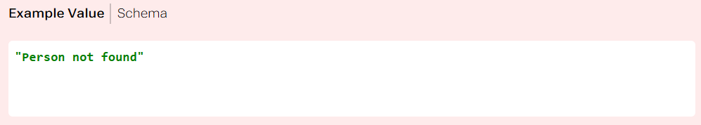

### Get : /sensor/{kind} List sensors of a given kind

Renvoie la liste des capteurs d'un type donné en paramètre de la route. La route utilisée est Get /sensor/{kind}.

Voici ce que nous renvoie notre fonction en mettant en paramètre le type de capteur à "EVCharger" :

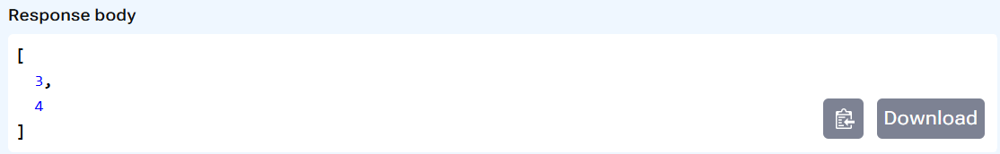

Voici ce que la fonction est censée nous renvoyer en mettant en paramètre le type de capteur à "EVCharger" :

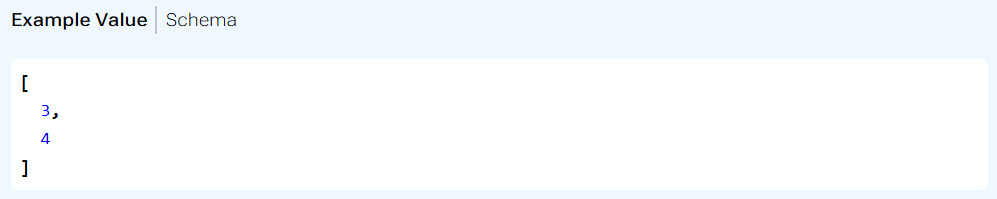

### Get : /producers List all producers

Renvoie la liste des producteurs d'énergie de la base de données en utilisant la route Get /producers.

Voici ce que nous renvoie notre fonction :

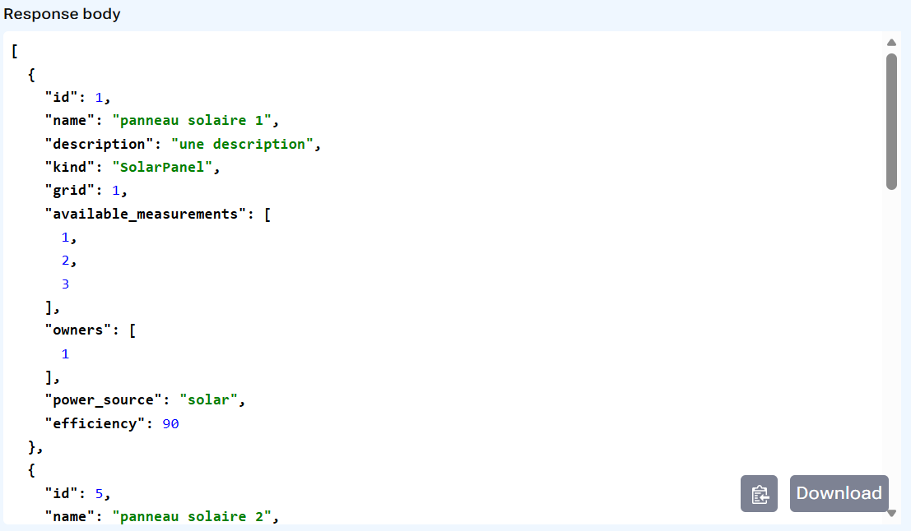

Voici ce que la fonction est censée nous renvoyer :

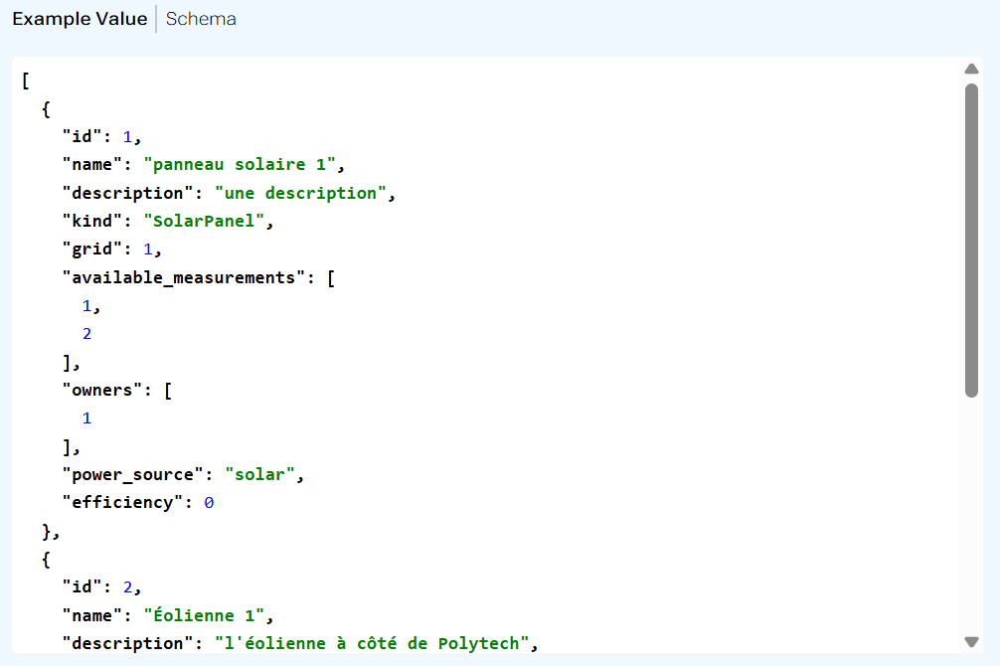

### Get : /consumers List all consumers

Renvoie la liste des consommateurs d'énergie de la base de données en utilisant la route Get /consumers.

Voici ce que nous renvoie notre fonction :

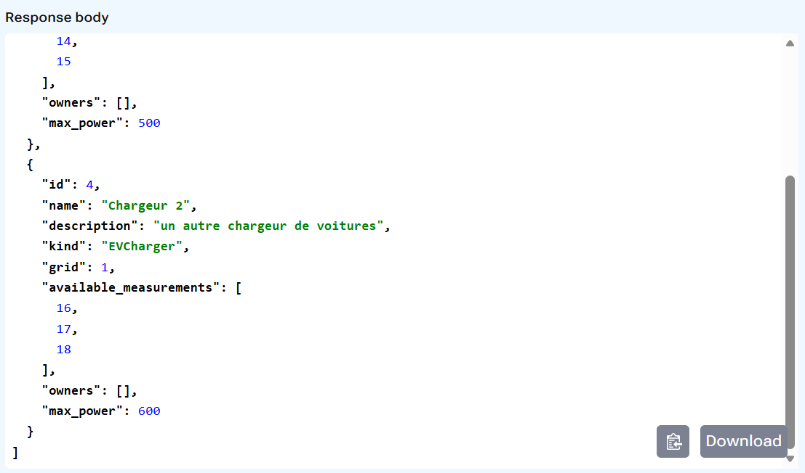

Voici ce que la fonction est censée nous renvoyer :

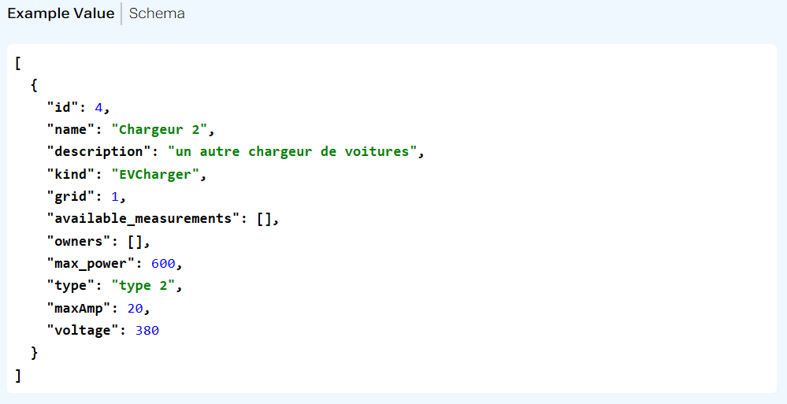

## Partie Advanced

### Post : /ingress/windturbine Receive wind turbine measurement

Ajoute une mesure à une élolienne dans la table Measurement en utilisant la route Post /ingress/windturbine.

Ce que nous renvoie notre fonction après l'ajout de la nouvelle mesure en cas de résussite :

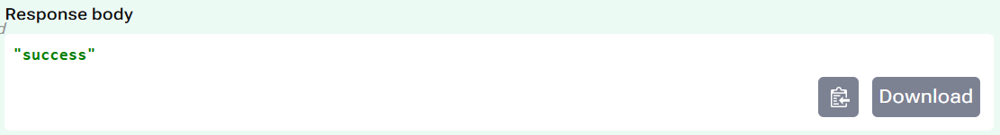

Ce que la fonction est censée nous renvoyer après l'ajout de la nouvelle mesure en cas de résussite :

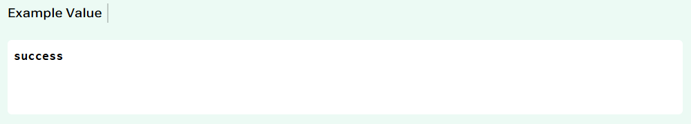

Ce que nous renvoie notre fonction après l'ajout de la nouvelle mesure en cas d'échec :

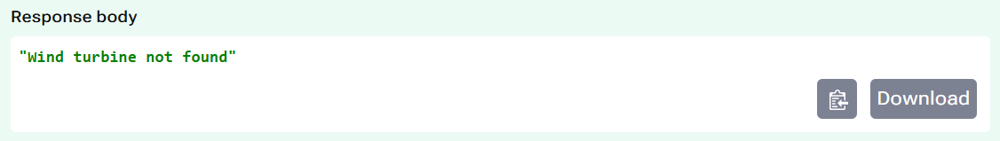

Ce que la fonction est censée nous renvoyer après l'ajout de la nouvelle mesure en cas d'échec :

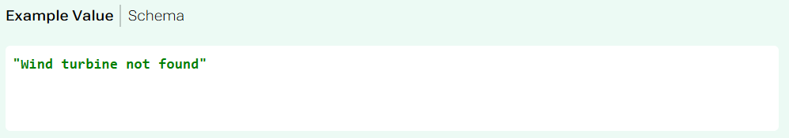

### Post : /ingress/solarpanel Receive solar panel measurement

Ajoute une mesure à un panneau solaire dans la table Measurement en utilisant la route Post /ingress/solarpanel.

Ce que nous renvoie notre fonction après l'ajout de la nouvelle mesure en cas de résussite :

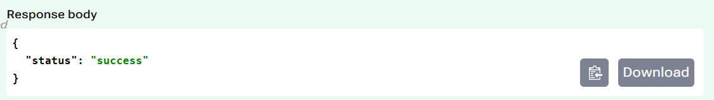

Ce que la fonction est censée nous renvoyer après l'ajout de la nouvelle mesure en cas de résussite :

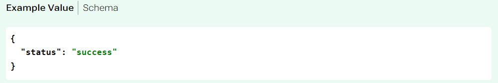

Ce que nous renvoie notre fonction après l'ajout de la nouvelle mesure en cas d'échec :

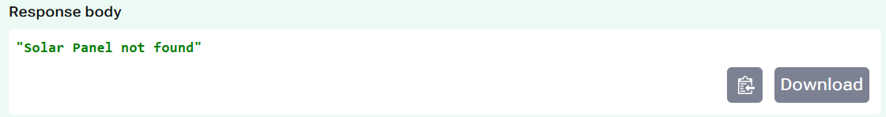

Ce que la fonction est censée nous renvoyer après l'ajout de la nouvelle mesure en cas d'échec :

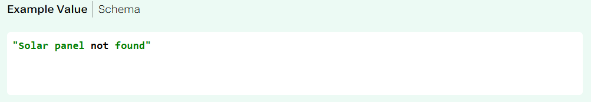

### Get : /sensor/{id} Get sensor detail

Renvoie les détails d'un objet de la classe Sensor pour un id donné en paramètre de la route. La route utilisée est Get /sensor/{id}.

Ce que nous renvoie notre fonction en mettant en paramètre l'id à 2 :

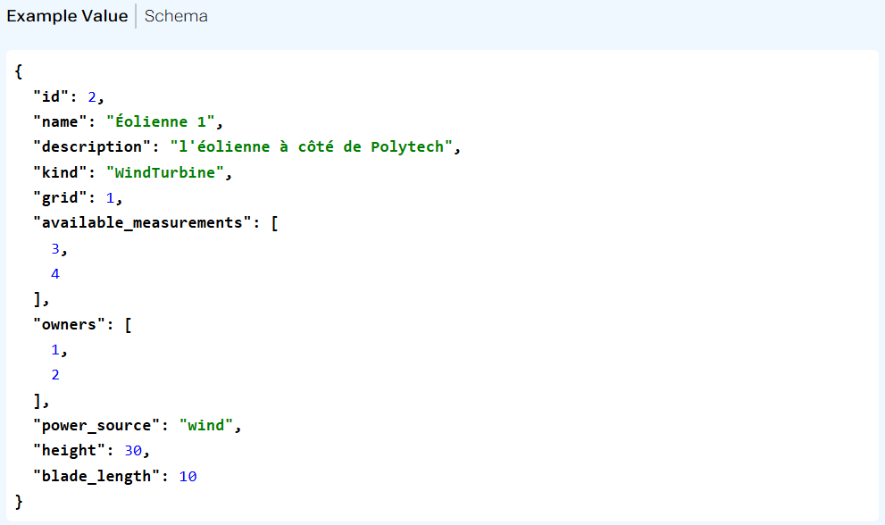

Ce que la fonction est censée nous renvoyer en mettant en paramètre l'id à 2 :

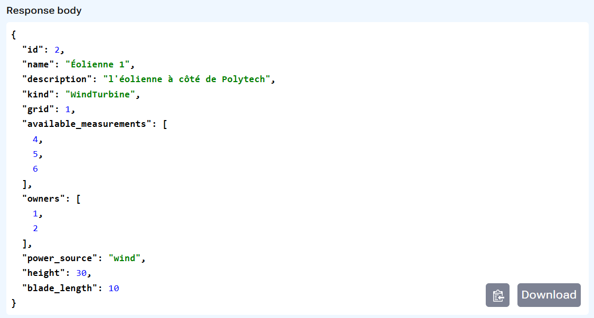

### Post : /sensor/{id} Update a sensor

Met à jour les détails d'un objet de la classe Sensor pour un id donné en paramètre de la route, en utilisant La route Post /sensor/{id}.

Ce que nous renvoie notre fonction en mettant en paramètre l'id à 2 après la mise à jour du capteur en cas de résussite :

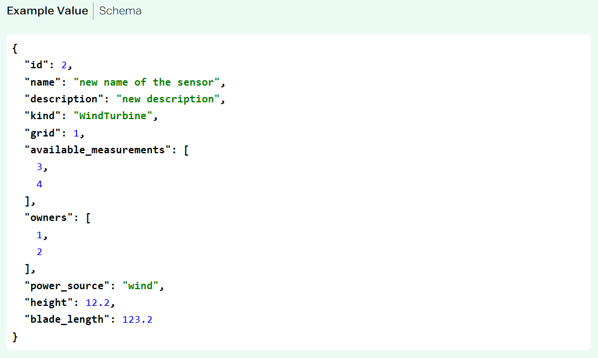

Ce que la fonction est censée nous renvoyer en mettant en paramètre l'id à 2 après la mise à jour du capteur en cas de résussite :

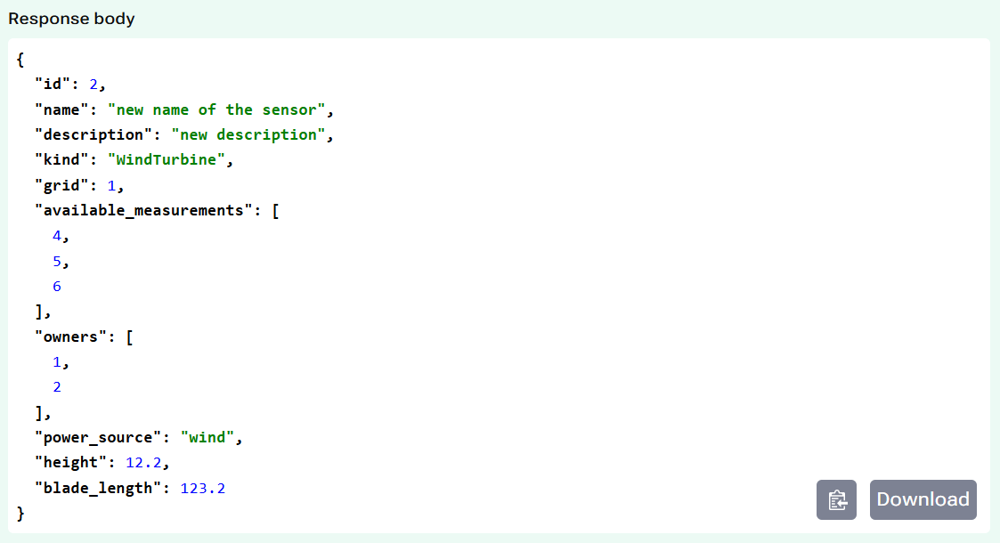

### Get : /measurements/{id}/values Get measurement values

Renvoie les valeurs d'une mesure pour un id donné en paramètre de la route. La route utilisée est Get /measurements/{id}/values.

Ce que nous renvoie notre fonction en mettant en paramètre l'id à 1 :

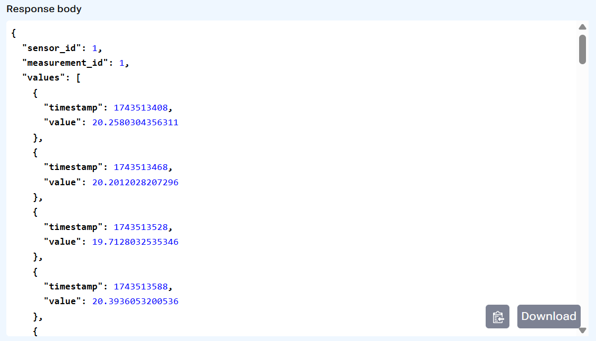

Ce que la fonction est censée nous renvoyer en mettant en paramètre l'id à 1 :

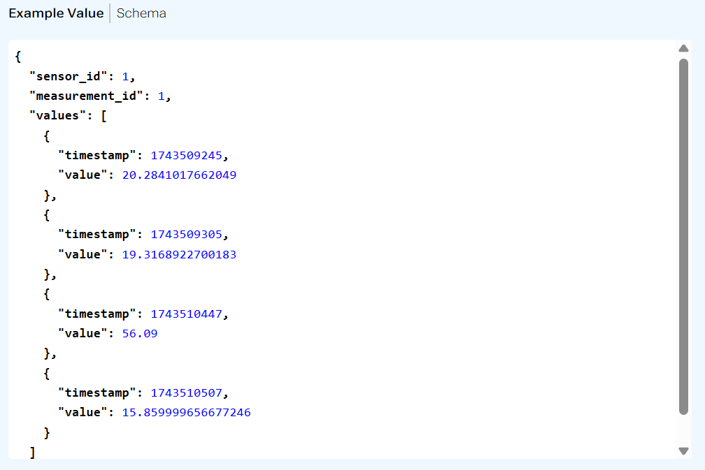

## Partie Hard

### Get : /grid/{id}/production Get grid total production 

Renvoie la valeur numérique correspondant au total de la production. La route utilisée est Get /grid/{id}/production.

Ce que nous renvoie notre fonction en mettant en paramètre l'id à 1 :

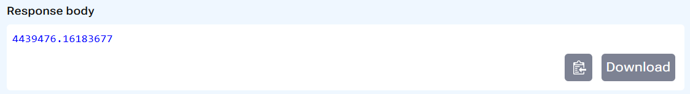

Ce que la fonction est censée nous renvoyer en mettant en paramètre l'id à 1 :

### Get : /grid/{id}/consumption Get grid total consumption

Renvoie la valeur numérique correspondant au total de la consommation. La route utilisée est Get /grid/{id}/consumption.

Ce que nous renvoie notre fonction en mettant en paramètre l'id à 1 : 

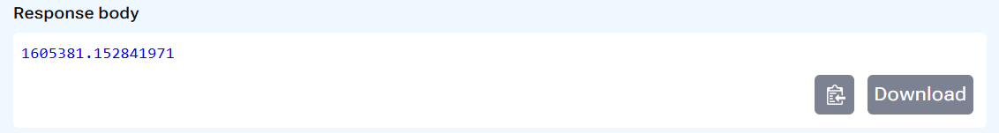

Ce que la fonction est censée nous renvoyer en mettant  en paramètre l'id à 1 :

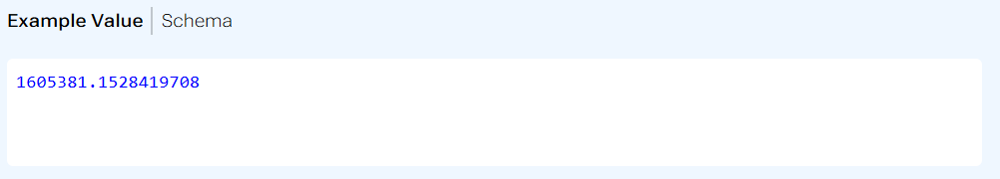

## Tests automatiques

Nous avons réalisé des tests automatiques pour les différentes fonctions de notre API, en utilisant la librairie RestAssured ainsi que la libraireie Apache Maven. Ces tests se trouvent dans le fichier "ApiTest.java" qui se trouve dans le dossier "src/test/java". Nous avons fait en tout 67 fonctions de test pour les différentes fonctions de notre API, en testant à la fois les cas de réussite et les cas d'échec. Et voici les résultats de ces tests :

## Remarque

Il y a une différence de valeur entre celles que nous renvoyons et celles que nous sommes sensés renvoyer pour la fonction get /measurement/{id}/values, car les valeurs que nous sommes sensés renvoyer n'existent pas dans la base de données. Nous avons donc affiché les valeurs présentes dans la base de données.

Il y a aussi une erreur sur les nombres renvoyés par les deux fonctions de la partie hard, ils ne sont pas identiques mais très similaires. Cette différence peut s'expliquer par la précision flottante qui modifie un peu les nombres, notamment ceux avec une certaine quantité de chiffres après la virgule, comme c'est le cas dans les données que nous traitons.

## Utilisation de l'IA

Dans le cadre de notre projet, nous avons fait le choix stratégique d’intégrer l’intelligence artificielle de manière ciblée, en nous concentrant sur des aspects spécifiques où son apport était le plus pertinent. Concernant les tests, l’IA s’est avérée particulièrement utile pour deux raisons majeures. D’une part, elle nous a permis de comprendre plus rapidement la syntaxe de RestAssured, un framework que nous découvrions, en générant des exemples concrets et en expliquant des concepts complexes. D’autre part, elle a grandement facilité la rédaction de nos tests en identifiant et en automatisant les parties redondantes entre eux, ce qui a réduit le temps de développement tout en garantissant une couverture de test cohérente et exhaustive. Par ailleurs, nous avons également exploité l’IA pour améliorer la qualité de notre code en générant des commentaires plus détaillés et mieux structurés que des commentaires écrits à la main.
